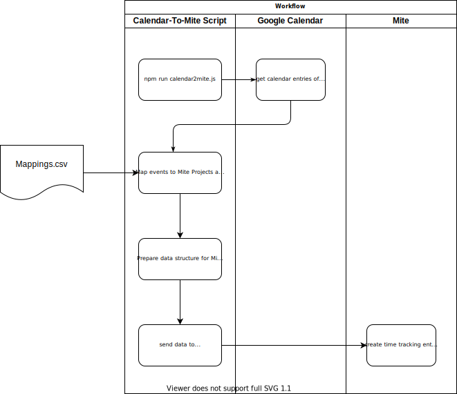

# Calendar to mite
With this script, you can automatically generate Time Tracking entries for Mite (https://mite.yo.lk/) by mapping your 
Google Calendar events to specific projects and services.

## Workflow


## How to / installation
```bash
git clone git@github.com:moritzwachter/calendar-to-mite.git 
cd calendar-to-mite/
npm install
cp .env.dist .env
```

Log into your Mite-Account and create an API-Key inside your settings page. Paste your API-Token into your `.env` file.

Additionally, you have to enable the Google Calendar API (https://developers.google.com/calendar/quickstart/nodejs) and
save your `credentials.json` in `./.google/`.

Finally, run the application by calling 
```bash
node c2m.js
```

## Mappings
Use the `example-mappings.csv` as a sample file for your mappings. The keyword can be any part of your Calendar event's
title. The keyword is case-sensitive. You can find your project and service ids either in some Mite reports or by 
searching through the page's source code `id="time_entry_project_id"` or `id="time_entry_service_id"`.

## Attention
*This script in its current version (v0.1) is getting your Google Calendar events for the last 7 days and immediately 
creates Mite entries for them! To change the timings, check `function runApplication(auth) { ... }` inside `c2m.js`.*
